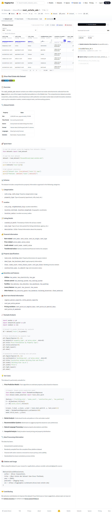

# Visited: https://huggingface.co/datasets/divarofficial/real_estate_ads
**Time:** Sun May 10 07:47:32 UTC 2026

## Screenshot

## Raw HTML
[page.html](./page.html)

## Downloaded Media (1 files)
## Downloaded Media Files

## Other Links
- [#](#)
- [#🏠-divar-real-estate-ads-dataset](#🏠-divar-real-estate-ads-dataset)
- [#🏢-property-specifications](#🏢-property-specifications)
- [#🏨-short-term-rental-information](#🏨-short-term-rental-information)
- [#🏷️-categorization](#🏷️-categorization)
- [#💡-use-cases](#💡-use-cases)
- [#💰-financial-information](#💰-financial-information)
- [#📈-example-analysis](#📈-example-analysis)
- [#📊-schema](#📊-schema)
- [#📋-overview](#📋-overview)
- [#📍-location](#📍-location)
- [#📚-citation-and-usage](#📚-citation-and-usage)
- [#📝-listing-details](#📝-listing-details)
- [#🔍-dataset-details](#🔍-dataset-details)
- [#🔧-data-processing-information](#🔧-data-processing-information)
- [#🚀-quick-start](#🚀-quick-start)
- [#🛋️-amenities-and-features](#🛋️-amenities-and-features)
- [#🤝-contributing](#🤝-contributing)
- [/](/)
- [/datasets](/datasets)
- [/datasets/divarofficial/real_estate_ads](/datasets/divarofficial/real_estate_ads)
- [/datasets/divarofficial/real_estate_ads/discussions](/datasets/divarofficial/real_estate_ads/discussions)
- [/datasets/divarofficial/real_estate_ads/tree/main](/datasets/divarofficial/real_estate_ads/tree/main)
- [/datasets/divarofficial/real_estate_ads/tree/refs%2Fconvert%2Fparquet/default](/datasets/divarofficial/real_estate_ads/tree/refs%2Fconvert%2Fparquet/default)
- [/datasets/divarofficial/real_estate_ads/viewer/](/datasets/divarofficial/real_estate_ads/viewer/)
- [/datasets/divarofficial/real_estate_ads/viewer/default/train](/datasets/divarofficial/real_estate_ads/viewer/default/train)
- [/datasets/divarofficial/real_estate_ads/viewer/default/train?p=0](/datasets/divarofficial/real_estate_ads/viewer/default/train?p=0)
- [/datasets/divarofficial/real_estate_ads/viewer/default/train?p=1](/datasets/divarofficial/real_estate_ads/viewer/default/train?p=1)
- [/datasets/divarofficial/real_estate_ads/viewer/default/train?p=2](/datasets/divarofficial/real_estate_ads/viewer/default/train?p=2)
- [/datasets/divarofficial/real_estate_ads/viewer/default/train?p=9999](/datasets/divarofficial/real_estate_ads/viewer/default/train?p=9999)
- [/datasets/divarofficial/real_estate_ads?duplicate=true](/datasets/divarofficial/real_estate_ads?duplicate=true)
- [/datasets?format=format%3Acsv](/datasets?format=format%3Acsv)
- [/datasets?library=library%3Adatasets](/datasets?library=library%3Adatasets)
- [/datasets?library=library%3Apandas](/datasets?library=library%3Apandas)
- [/datasets?modality=modality%3Atabular](/datasets?modality=modality%3Atabular)
- [/datasets?modality=modality%3Atext](/datasets?modality=modality%3Atext)
- [/datasets?size_categories=size_categories%3A1M%3Cn%3C10M](/datasets?size_categories=size_categories%3A1M%3Cn%3C10M)
- [/divarofficial](/divarofficial)
- [/docs](/docs)
- [/enterprise](/enterprise)
- [/front/build/kube-87b6ff9/style.css](/front/build/kube-87b6ff9/style.css)
- [/huggingface](/huggingface)
- [/join](/join)
- [/js/script.js](/js/script.js)
- [/kvn420/Tenro_V4.1](/kvn420/Tenro_V4.1)
- [/login](/login)
- [/models](/models)
- [/pricing](/pricing)
- [/privacy](/privacy)
- [/spaces](/spaces)

## Stats
- Links: 70
- Media: 1
